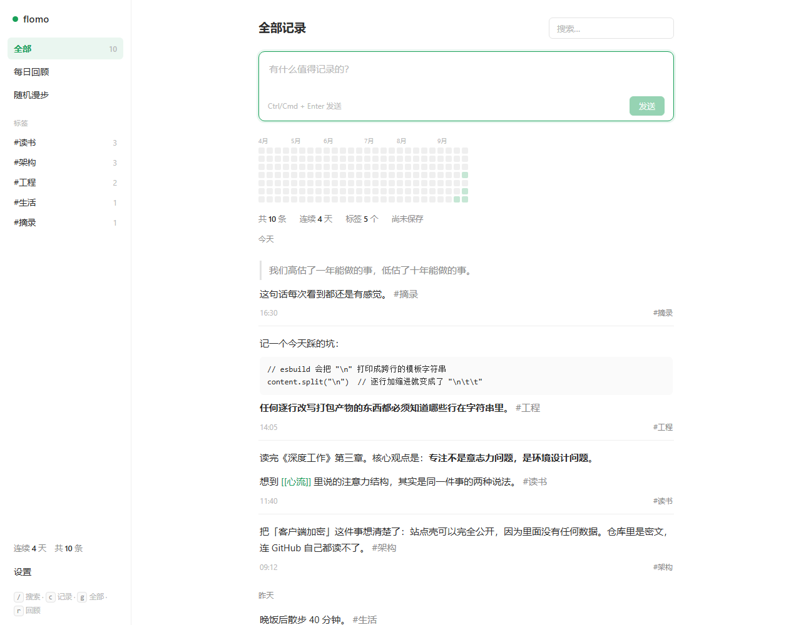
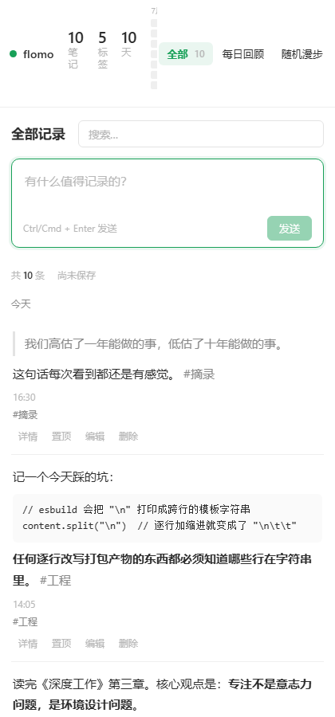
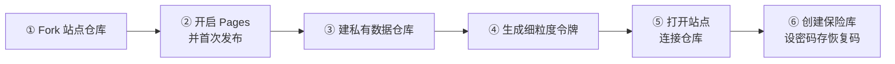
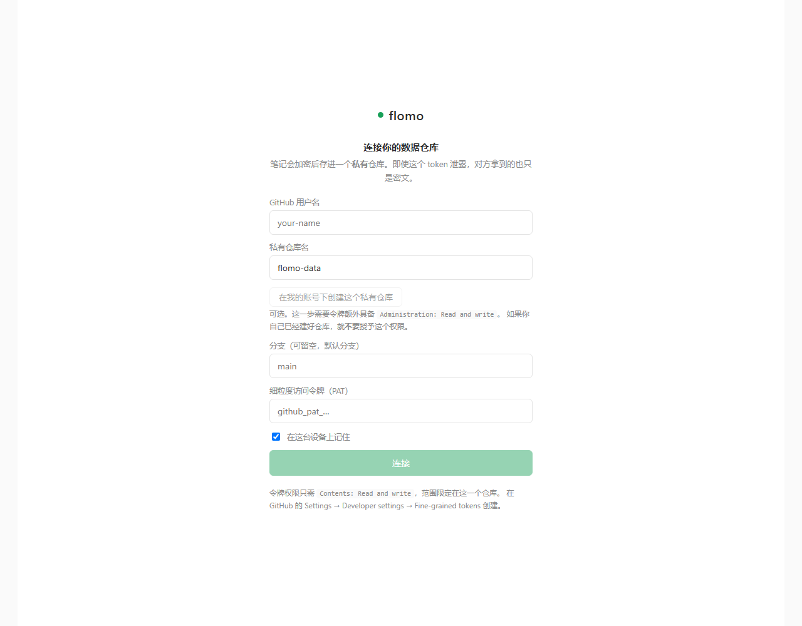
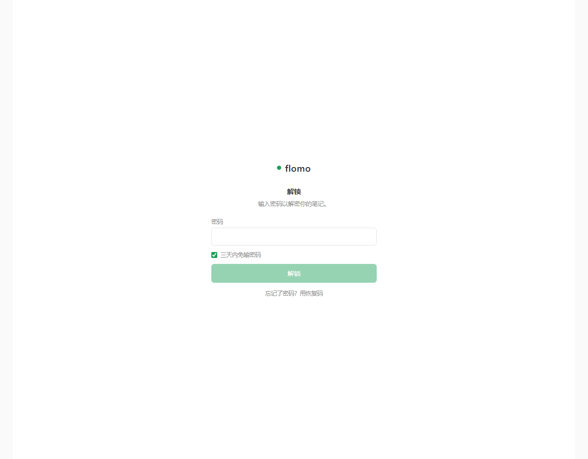
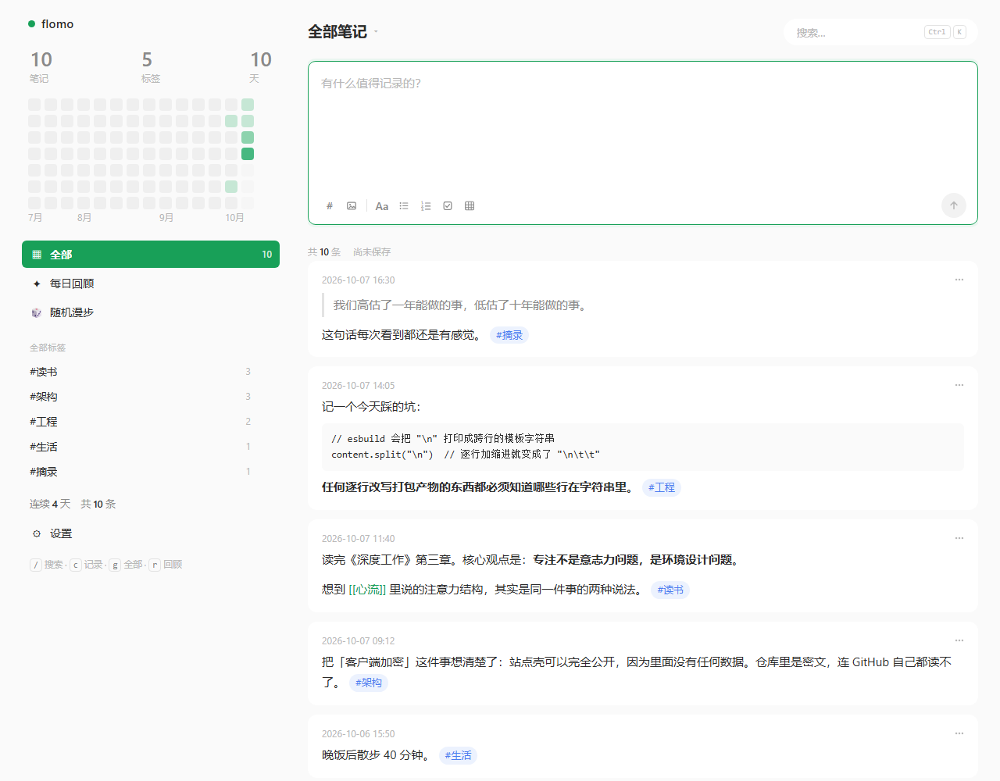

# flomo-sim

一个参考 [flomo](https://flomoapp.com) 的极简笔记应用：**数据端到端加密后存在你自己的 GitHub 私有仓库**，既能当静态网站用，也能作为 DeepSeek Harness 的侧边栏面板直接查看和记录。

- **零服务器**：站点是纯静态的，部署到 GitHub Pages 免费
- **真加密**：密码即密钥（PBKDF2-SHA256 60 万次 → AES-256-GCM），仓库里只有密文
- **两套外壳，一套内核**：网页版和 DSH 面板共用同一个 `@flomo/core` 与 `@flomo/ui`
- **Agent 可读写**：装上 DSH 插件后，对话里说「记一条」就能落库



<sub>截图由 `scripts/screenshot.mjs` 生成：真实浏览器、真实加密保险库、真实解锁流程。
下面那份是解锁门禁。</sub>


窄屏（≤720px）下侧栏变成**可横向滚动的导航条**，而不是消失：



> **要改这个仓库？先读 [开发说明](docs/DEVELOPING.md)。**
> 里面记着分层规则，以及一批**读代码看不出来**的坑：DSH 的 host 半为什么必须重启才能生效、
> 样式表的注释里为什么不能写反引号、`defineTool` 为什么不是等价函数。
>
> **想知道哪些事被真正验证过？读 [验证现状](docs/VERIFICATION.md)。**
> 它分开列了"自动化验证过的"和"只有真人能确认的" —— 后者包括 DSH 面板是否真的挂上、
> 以及 agent 工具在真实 DSH 里的注册状态。

---

## 已实现的功能

**记录与浏览**
- 快速输入框：自动聚焦、自动增高、`Ctrl/Cmd + Enter` 提交
- MEMO 卡片流：按日分组，置顶的排在最前，悬停出现详情/编辑/删除/置顶
- **代码块与引用块**：` ``` ` 围栏（保留语言标记）与 `>` 引用。
  围栏里的内容**原样显示、不参与解析** —— 见下面"围栏不是散文"
- **行内标记**：`**加粗**` 与 `` `行内代码` ``，和 `#标签`、`[[链接]]` 由**同一个分词器**
  识别 —— 一条正则，所以高亮、标签索引和链接解析不可能对同一段文字有不同看法
- `#标签` 写在正文里自动解析，支持嵌套 `#父/子`；标签侧栏带计数，点击即筛选
- 输入框里的 **`#` 自动补全**：按使用频率排序，前缀匹配优先于包含匹配，
  `↑`/`↓` 选择、`Enter`/`Tab` 接受、`Esc` 关掉。
  补全的触发规则与解析器**刻意保持一致** —— 解析器接受 `今天读到#认知失调` 这种
  紧贴前文的写法，补全就不会在同样的位置拒绝帮忙
- 全文搜索（大小写不敏感的子串匹配，可预测胜过"聪明"）
- 行内编辑，`Esc` 取消、`Ctrl/Cmd + Enter` 保存
- **快捷键**：`/` 搜索、`c` 记录、`g` 全部、`r` 回顾、`w` 随机漫步
  （不带修饰键的字母键只在**没有焦点在输入框里**时生效，绝不会抢走你正在打的字）

**双向链接**
- 正文里写 `[[某个想法]]` 即可链接；标签与链接由**同一个分词器**识别，
  所以界面上高亮出来的，永远等于索引里存下来的
- 点击 `[[链接]]` 跳到所有指向它的记录；点「详情」进入单条视图，
  可以看见它的**出链**与**反向链接**
- 解析规则：`[[X]]` 指向**在散文或标签里提到过 X** 的记录，
  且**永不指向自己**。关键在于判定散文时会**先把链接标记抹掉** ——
  否则两条都写了 `[[深度工作]]` 的记录会因为彼此都含有这四个字而互相成为反向链接

**回顾（flomo 的灵魂）**
- **每日回顾**：3 条较旧记录，**当天固定不变**（用日期做种子），并排除最近两天
- **随机漫步**：一次一条，可「再抽一条」
- **侧栏顶部的三个数字**（笔记 / 标签 / 天）与**记录热力图** —— 和 flomo 一样放在
  导航**上方**：它们描述的是整个语料，摆在信息流上方只会把笔记往下挤。
  热力图在侧栏显示约 12 周（宽度所限），带月份标签
- 「天」是**从第一条记录至今**的天数，不是"有记录的天数" —— flomo 也是这个口径

**数据**
- 导出 **Markdown**（按绝对日期分组，便于阅读和 grep）
- 导出 **JSON**（保留 `id` 与两个时间戳，可完整还原）
- **导入 JSON** —— **只增不改**：id 已存在的记录会被跳过，所以拿备份覆盖到在用的保险库上，
  永远不会悄悄回滚较新的编辑。标签一律从正文**重新解析**，不信任文件里的 `tags` 字段
- 自动保存（1.5 秒防抖）+ 手动「立即保存」；导入则立即落盘

**安全**
- 密码解锁门禁，`PBKDF2-SHA256` 60 万次派生
- 一次性**恢复码**（等同密码，用于忘记密码时取回数据）
- 写入冲突检测：多设备同时改同一个月会提示重试，而不是静默覆盖

**离线读取**
- 网络不可达时，从本机缓存读出上次同步到的内容，界面明确标注"离线中"
- 缓存的是**密文**，不是笔记。缓存副本和仓库里那份一样不可读 ——
  所以放进 `localStorage` 不损失任何保密性；缓存明文才会把整个设计的意义抹掉
- 读取是**网络优先**：缓存只是兜底。设备在线时看到的永远是仓库的当前状态；
  只有网络**失败**才回退，而一次成功的 404 是事实，会清掉缓存
- **写入不排队**：连不上网就报错。假装保存成功、而用户在仓库里看不到，是唯一比报错更糟的结果

**离线启动（Service Worker）**
- 应用外壳也被缓存，所以断网时**页面本身**能打开 —— 没有这一半，上面的数据缓存等于没用
- 策略刻意保守，因为 Service Worker 的失败模式是"应用看起来坏了"而且**很黏**：
  - **导航请求网络优先** —— 在线访客永远拿到最新 HTML，陈旧的 worker 不可能把人钉在旧版本上
  - **带哈希的资源缓存优先** —— Vite 给文件名加了内容哈希，同一个 URL 的字节永不变
  - **跨域请求一律不碰** —— 保险库在 `api.github.com` 后面，在这里缓存 API 响应会和
    core 自己的密文缓存打架，产生难以解释的陈旧读取
  - **非 GET 一律不碰**
- 只在生产构建里注册（开发环境下 Service Worker 会和 Vite 的模块图打架）
- 出问题时的逃生口：`CACHE_NAME` 一改，`activate` 会删掉其他所有缓存

**可安装（PWA）**
- manifest 声明了 192/512 两种尺寸，外加一个 **maskable** 图标（少了它，Android
  会把图标塞进一个方框里）
- 单独的 `apple-touch-icon` —— iOS 不看 manifest 的图标
- 图标由 `packages/web/scripts/make-icons.py` 生成并提交，所以 CI 不需要 Pillow。
  生成脚本与插件图标 `packages/dsh-plugin/icon.svg` 是同一个形状

---

### 围栏不是散文

标签和链接都从正文里提取，而**代码围栏不是散文**：

~~~text
```c
#include <stdio.h>
```
~~~

这里的 `#include` 是预处理指令，不是标签；围栏里的 `[[x]]` 是方括号语法，不是链接。

所以标签索引、链接解析、渲染器读的是**同一份块结构**（`core/blocks.ts`），
正如它们此前已经共用同一个行内分词器。否则每个粘贴过 C 代码的人，标签列表里都会
多出 `include` 和 `define`，而标签列表就不再是"你在写什么"的描述。

同理，输入框的 `#` 补全在围栏内**不触发** —— 字段绝不能提供一个解析器会拒绝记录的标签。

---

## 为什么是"客户端加密"而不是"登录"
GitHub Pages 是纯静态托管，**没有服务端，因此做不了真正的登录**。任何"输入密码 → 跳转"的纯前端写法，密码都躺在 JS 源码里，等于没有。

所以这里换了个思路：不做「登录」，做「**解密**」。

```
密码 ──PBKDF2-SHA256(600k, 随机 salt)──▶ AES-256-GCM 密钥
                                            │
                          密文 shard ◀──────┘  解密成功 == 密码正确
```

- 站点壳公开，但里面没有任何数据
- 仓库里是密文；AES-GCM 自带认证标签，密码错了根本解不出来
- **连 GitHub 自己都读不了你的笔记**
- 不需要单独存密码哈希 —— 解密成功本身就是验证。
  仓库里那段**已知明文的密文**（`vault.json` 的 `check`）确实可以拿来试密码，
  但那正是重点：**每次猜测都要跑满 60 万次 PBKDF2**，攻击者付的代价和你一样；
  而一个裸的 SHA-256 哈希会便宜好几个数量级。所以这里没有"额外的"廉价 oracle 可打

### 安全性质

> **PAT 泄露 ≠ 笔记泄露。**

即使有人从浏览器里偷到你的 GitHub token，他拿到的也只是密文文件，还需要你的密码 ——
而密码从不离开你的设备，也从不写进任何仓库。

### 三天免密

解锁表单上有一个默认勾选的「**三天内免输密码**」。勾着时，本设备会在 `localStorage` 里
保存**派生密钥**（和恢复码同格式，**不是密码**）并带 72 小时过期：三天内刷新、重开浏览器
都直接进入笔记；到期、或在别的设备改了密码、或换了仓库时，保存的密钥校验失败会被自动
清除，回到密码页。不勾选则每次刷新都要输入。

要诚实地说清代价：勾选后，`localStorage` 里同时有 token 和派生密钥，**能读到浏览器
存储的人就能读到笔记** —— 这和 flomo 官方的「记住我」是同一种取舍，适合私人设备，
不适合公用电脑。

### 诚实的代价

- **忘记密码 = 数据永久丢失**。所以首次创建保险库时会生成一个**恢复码**（原始密钥的 base64）。请抄写到密码管理器或纸上，**不要**放进这个仓库。
- 单人使用无并发问题；多设备同时写同一月份会有 git 冲突，此时会提示重试而不是静默丢数据。

### 没有防护的

端到端加密保护的是**传输中和静止的数据**，不是一台已经被攻陷的设备。

- **浏览器被攻陷时（恶意扩展、页面上的 XSS），解密后的明文就在内存里。** 这是客户端加密的固有边界 —— 任何"在浏览器里解密"的方案都一样，不是这个实现的疏漏。
- 保险库解锁期间，DSH 面板通过**回环地址上的 HTTP** 读取明文（`/flomo-sim/api/state`）。这道闸门真正起作用的是**套接字必须来自本机**，而且它**刻意与 DSH 自己的共享闸门（`dsh-web-shared/host/loopback`）保持一致** —— 因为曾经这里比平台更严，结果把面板自己的请求也挡成了 403：
  - **套接字必须是环回**（整个 `127/8` + `::1` + IPv4-mapped），**Host 头也必须是环回主机名** —— 这两条是实质性的
  - 浏览器标记**只能否决，不能放行**：`sec-fetch-site: cross-site` 直接拒；只要带了 `Origin`，就**一定**会与 `Host` 比对
  - **完全不带标记的请求是放行的** —— 网页产生不出这种请求（浏览器总会附带 `sec-fetch-site`），而本机进程本来就不受请求头约束
  - 结论：**别的网页读不到**（它要么带 `cross-site`，要么带一个对不上的 `Origin`）
  - **但本机其他进程读得到** —— 它想设什么头就设什么头，而这样的进程本来就能直接读 `~/.dsh/.credentials.yaml` 和 `~/.dsh/flomo.json`，所以没有实质扩大信任边界
  - **同一个源上的其他 DSH 插件也读得到** —— 它们和 flomo 面板共享一个文档（这也是所有 CSS 选择器都带 `fl-` 前缀的原因）。装插件时值得知道这一点
  - 被拒时**响应里会写明原因和实际收到的头**（`reason` / `observed`）—— 一个不说明理由的 403 从外面看是无法诊断的
- 如果你把密钥或密码**写进笔记正文**，那它就是笔记的一部分 —— 加密不会替你区分。

---

## 架构

```
公开仓库（本站点，GitHub Pages）
  └─ 只有站点壳 + 密码框，无任何数据
        │  解锁后，浏览器内解密 + 读写
        ▼
私有仓库 flomo-data           ← 只当存储，不涉及 Pages，所以免费
  ├─ vault.json               KDF 参数 + 一段已知明文的密文（无秘密，可公开）
  └─ data/2025-06.json        按月分片的密文
        ▲  共用同一个 core
        │
DSH 插件 dsh-flomo
  ├─ host 面：vault + PAT + 解密密钥 + agent 工具
  └─ client 面：侧栏图标 + 中央全页 flomo 面板
```

**每月一个分片**的理由：单文件写爆 1MB 后 GitHub Contents API 会变慢；分片后每次只改一个月，diff 干净、冲突面小。

**没有索引文件**：月份列表来自目录列举，这样两台设备写不同月份时永远不会争抢同一个可变文件。

---

## 从零部署指南（图文，约 10 分钟）

全程只用到 GitHub 的免费额度：站点壳跑在 Pages，数据仓库是私有的、不走 Pages。



### 第 ① 步：Fork 站点仓库

打开 **<https://github.com/wuhy80/flomo-web/fork>**，直接点 **Create fork**。
站点壳的代码是公开的（里面没有任何你的数据），Fork 到你自己账号下才能发布。

Fork 完成后，进入你仓库的 **Actions** 标签页；如果提示 workflows 未启用，点
**I understand my workflows, go ahead and enable them** 启用。

### 第 ② 步：开启 GitHub Pages 并首次发布

1. 在**你的**仓库：**Settings → Pages**，把 **Build and deployment → Source**
   选成 **GitHub Actions**；
2. 打开 **Actions** 标签 → 左侧选 **Deploy web app to GitHub Pages** →
   右侧 **Run workflow ▾** → 保持 `main` → **Run workflow**；
3. 等它跑完（约 1 分钟，出现绿色 ✓）。

此后 **<https://你的用户名.github.io/flomo-web/>** 就是你的站点了。以后每次
push 到 `main` 会自动重新构建发布，也可以随时手动 Run workflow。

> 不想用 Fork？把你本地这份代码 push 到自己的公开仓库（`main` 分支）也可以，
> 后续步骤完全一致。`base: './'` 让域名根路径和 `/仓库名/` 子路径都能直接用。

### 第 ③ 步：创建私有数据仓库

打开 **<https://github.com/new>**：仓库名填 `flomo-data`，选择 **Private**，
其他一律不勾，点 **Create**。

> ⚠️ **数据仓库必须私有**。私有仓库不享受免费 Pages——但这里的数据仓库只当
> 存储用，根本不走 Pages，所以依然免费。

### 第 ④ 步：生成细粒度访问令牌

打开 **<https://github.com/settings/personal-access-tokens/new>**
（头像 → Settings → Developer settings → Fine-grained tokens → Generate new token）：

| 配置项 | 填什么 |
|---|---|
| Token name | 随意，例如 `flomo-sim` |
| Expiration | 建议设长一些（到期后保存会失败，需重新生成再连接） |
| Repository access | **Only select repositories** → 勾 `flomo-data` |
| Permissions → Repository permissions → **Contents** | **Read and write** |

点 **Generate token**，立刻复制 `github_pat_` 开头的令牌——**只显示这一次**。
其他权限一律不需要。

### 第 ⑤ 步：打开站点，连接仓库

访问你的站点，首次会看到连接表单：



| 字段 | 填什么 |
|---|---|
| GitHub 用户名 | 你的账号 |
| 私有仓库名 | `flomo-data`（**必须私有**） |
| 分支 | 留空（默认分支） |
| 细粒度访问令牌（PAT） | 第 ④ 步的令牌 |

保持「在这台设备上记住」勾选，点**连接**。
（表单上还有个可选的「在我的账号下创建这个私有仓库」——那是给没建仓库的人用的，
需要令牌额外带 `Administration: Read and write`。按本指南自己建好了仓库，就**不要**
授予这个权限。）

### 第 ⑥ 步：创建保险库，设置密码

连接成功后会进入创建保险库页面（和下面的解锁页同一个界面）：设置密码并确认。
创建后会展示一串**恢复码**——它是忘记密码时取回数据的唯一途径，请抄到密码
管理器或纸上。



解锁后就是主界面，可以开始记录了：



### 第 ⑦ 步（可选）：装到手机主屏

手机浏览器访问站点 → 菜单「添加到主屏幕/安装应用」。之后配合系统分享或
快捷指令，微信里看到的内容可以一键进笔记，见[微信里快速输入](#微信里快速输入)。

### 常见问题

- **想本地开发？** `pnpm install && pnpm dev`，打开 <http://localhost:5273>。
- **保存失败/令牌过期？** 令牌到期或被删会让保存报错：重新生成一个（第 ④ 步），
  在站点上断开连接后用新令牌重新连接即可。
- **忘记密码？** 用恢复码解锁；恢复码和密码都丢了，数据无法找回——这是端到端
  加密的本质代价。
- **想更新到最新版？** 在你 Fork 的仓库里 **Sync fork → Update branch**，Pages
  会自动重新发布。
- **换设备？** 在新设备打开站点、填同样的仓库和令牌、输密码即可，笔记全在——
  它们一直在你的私有仓库里。

---

## 微信里快速输入

flomo 官方靠服务号 + 服务器接微信消息；本项目没有服务器，也不打算引入——
密钥从不离开设备是这个模型的前提。替代做法是**深链预填**：任何能打开 URL 的
工具（iOS/Android 快捷指令、启动器）都可以把文本拼进下面的地址，打开后内容
已填进输入框并聚焦，加密照常发生在你自己的设备上：

```
https://wuhy80.github.io/flomo-web/#compose=<URL 编码的正文>
```

以 iOS 为例：快捷指令新建一个「接收共享表单中的文本 → URL 编码 → 打开 URL」
即可；之后在微信里对一段文字或一篇文章点「分享 → 快捷指令」，落进输入框的
就是它们的文本。地址栏的片段在打开瞬间即被清除，刷新不会重复预填。

**安卓更直接**：把网站安装到主屏（PWA）后，它注册为系统分享目标
（Web Share Target）——在微信里点「分享」，分享面板里直接出现 flomo，
选它即唤起应用并预填，连快捷指令都不用建。此能力依赖 Android Chrome 对
已安装 PWA 的支持；iOS 仍走上面的快捷指令。

## 安装 DSH 插件

插件是双面的：host 面在 DSH 进程里持有 PAT、密钥和解密后的笔记；client 面只是在 Web GUI 里渲染。

```bash
pnpm build:plugin          # 产出 packages/dsh-plugin/lib/{index.js,client.js}
```

然后用插件管理器以 `link:` 方式装进 profile：

```
plugin_manager install_bundle  target = link:D:\code\flomo-sim\packages\dsh-plugin
```

装好后侧边栏会多出一个 **flomo** 图标，点开就是完整的 flomo 界面（和网页版是同一套 UI）。

### 配置与凭据

面板首次打开会让你填仓库与 token。它们分别落在：

| 内容 | 位置 |
|---|---|
| owner / repo / branch | `~/.dsh/flomo.json`（无秘密） |
| PAT | DSH 凭据中心的 `FLOMO_GITHUB_TOKEN` —— **由面板自己写入**，不需要任何命令行 |

（面板的 `configure` 动作会调用凭据服务的 `set(FLOMO_GITHUB_TOKEN, …)`，所以
"填一次表单"就是完整的配置流程。）

**密码默认不保存。** 面板里解锁后，密钥只存在于 host 内存中，DSH 重启后需要重新解锁 ——
这是更安全的默认值。

> **`FLOMO_PASSWORD`（可选，用于无人值守解锁）目前没有设置入口。**
> 插件只**读**这个凭据、从不写；`dsh` CLI 也**没有** `credentials` 子命令
> —— 它的用法是 `dsh [--profile] <name>`，而 `desktop` profile 明确报错
> "managed exclusively by the Electron application"。所以这一项只能靠 DSH 自己的
> 凭据管理界面（如果有）来设，**我没找到**。
> 想让 agent 工具在你没解锁时也能读写，目前需要先手动解锁一次。

### Agent 工具

| 工具 | 作用 |
|---|---|
| `flomo_add` | 记一条（`#标签` 写在正文里自动解析） |
| `flomo_search` | 全文搜索，可按标签过滤 |
| `flomo_recent` | 最近 N 条 |
| `flomo_daily_review` | 每日回顾（当天固定，排除最近两天） |
| `flomo_tags` | 标签统计 |
| `flomo_random` | 随机漫步 |

于是你可以直接说「把这条记到 flomo」或者「我上周记了什么关于架构的」。

> `flomo_add` 在返回成功前就已经加密并推到 GitHub，所以成功即持久化。

---

## 命令

| 命令 | 作用 |
|---|---|
| `pnpm dev` | 启动网页版开发服务器 |
| `pnpm build` | 构建网页版（`packages/web/dist`） |
| `pnpm preview` | 预览已构建的产物 |
| `pnpm smoke` | **部署冒烟测试**：像 GitHub Pages 那样静态服务 `dist/`，逐项检查 |
| `pnpm build:plugin` | 构建 DSH 插件两半 |
| `pnpm watch:plugin` | 监听模式重建插件 |
| `pnpm test` | 跑 core / ui / 插件 / web 的测试 |
| `pnpm typecheck` | 全仓类型检查 |
| `pnpm --filter @flomo/web shots` | 截图（需要 dev server，见上） |
| `pnpm --filter @flomo/web interact` | 真实浏览器交互检查（需要 dev server，见上） |

---

## 目录结构

```
packages/
├─ core/        零依赖内核：加密、Memo 模型、#标签解析、按月分片、GitHub 存储
│  └─ src/testing.ts   内存版仓库，以 `@flomo/core/testing` 子路径导出，
│                      四个包的测试都用它，不跨包去够别人的测试目录
├─ ui/          flomo 风格 React 组件与样式，网页版和面板共用
├─ web/         Vite 应用 + Pages 部署
└─ dsh-plugin/  dsh-flomo 双面插件
   ├─ src/index.ts      host 入口：注册路由与 agent 工具
   ├─ src/routes.ts     两个路由 + 一道守卫
   ├─ src/client/       侧栏图标 + 中央面板
   └─ build.mjs         两半的打包（含模块加载器封装）
```

### 一个刻意的设计

`@flomo/core` 和 `@flomo/ui` **直接以 TypeScript 源码分发**，不做预编译。谁用谁打包
（网页版用 Vite，插件用 esbuild）。这样整个 monorepo 没有构建顺序问题 —— 不需要
"先编译 A 才能编译 B"。

样式同理，以字符串常量导出（`packages/ui/src/styles.ts`）而不是 `.css` 文件，
因为在两个宿主里注入方式完全一致，不需要任何 loader 配置。

### 一个踩过的坑：不要逐行改写打包产物

插件的浏览器半必须以 `window.__ModuleLoader__.load({ id, factory })` 封装到达。
早先的 `build.mjs` 为了让封装体好看，把 bundle 的**每一行**都缩进了两个 tab ——
结果是静默地改坏了代码：esbuild 的压缩器会把 `"\n"` 打印成一个**跨两行**的模板字符串，
逐行加缩进就把缩进**注进了字符串里面**，于是每一处 `split("\n")` 都变成了
`split("\n\t\t")`。

缩进是装饰性的，损坏不是。**任何逐行改写 bundle 的东西都必须知道哪些行在字符串字面量里，
而唯一安全的数量是零。** 现在封装体原样插入，不再缩进 —— 并且上面那个代码块测试
就是它的回归防护。

---

## 测试

```bash
pnpm test          # 单元与集成测试
pnpm build && pnpm smoke   # 部署冒烟测试（针对构建产物）
```

### 部署冒烟测试

构建**成功**的 `dist/` 依然可能是浏览器用不了的：某个资源 URL 指向不存在的东西、
Service Worker 根本没被拷进去、一个绝对路径 `/assets/...` 在域名根下正常、
一部署到项目子路径就 404。**这些都不会让构建失败，但都会让用户失败。**

所以 `pnpm smoke` **像 GitHub Pages 那样**（纯静态文件、无 SPA fallback、无重写）
把 `dist/` 服务起来，然后检查真实返回了什么 —— 包括 `index.html` 引用的每个 URL 是否
解析得到、文件名是否真的带内容哈希（Service Worker 依赖这一点）、
以及 `sw.js` 承诺预缓存的那几个 URL 是否都可达。

CI 里它在 `pnpm build` 之后、发布之前运行，所以坏的部署在这里失败，而不是在别人浏览器里。

> 我验证过它**确实会失败**：把 `dist/sw.js` 藏起来，它会列出每一项失败的检查并退出 1。
> （第一次做这个反向验证时它其实是**崩掉**的 —— 抛出 `ENOENT` 堆栈而不是列出失败项。
> 对一个 CI 日志来说，堆栈会把其它发现全部盖住，所以已改成逐项报告。）

### 用真实浏览器看它

单元测试不能替代**看**。`packages/web/scripts/screenshot.mjs` 通过 DevTools 协议驱动
无头 Chrome：它把 `fetch` 换成一个基于**真实加密保险库**的 Contents API，
然后让**真正的应用**跑**真正的代码路径**、用**真正的表单**解锁、再截图。

关键是 mock 完全活在注入的页面脚本里 —— **没有任何东西进入产物**，
所以拍到的是应用本身，不是一个 demo 构建。

```bash
pnpm --filter @flomo/web dev                                   # 另开一个终端
node packages/web/scripts/screenshot.mjs http://127.0.0.1:5273/ shot.png
node packages/web/scripts/screenshot.mjs http://127.0.0.1:5273/ gate.png --locked
```

需要装 Chrome 或 Edge。它已经值回票价 —— 第一次运行就拍到两个**读代码永远发现不了**的缺陷：

- 我在正文里写 `**加粗**`，而应用把它**原样显示成星号**（顺带发现行内代码的 CSS 一直存在，
  但分词器从来不产生这种 token）
- 「在我的账号下创建这个私有仓库」用的是 ghost 样式，渲染出来**像一行灰字，不像按钮**

### 用真实浏览器**操作**它

看还不够 —— 截图只到"渲染出来了"为止。`packages/web/scripts/interact.mjs` 会
**在真实的输入框里打字、点发送、点编辑、点置顶**，然后检查应用**到底想持久化什么**。

```bash
pnpm --filter @flomo/web interact      # 两种视口各跑一遍，23 项检查
```

它验证的是那些**只有交互才能暴露**的东西：新记录出现在信息流、输入框自清空、
`#标签` 从正文解析出来、编辑是**替换**而不是追加、置顶**真的改变顺序** ——
以及**每一次写入里都没有明文**。

最后一条是**整个项目的核心主张**，而它是在**浏览器里**被验证的，不是靠服务层。
（顺带：它抓到过"手机上没有导航"—— 侧栏在窄屏被整个隐藏，而**看截图看不出能不能用**。）

两者共用 `packages/web/scripts/harness.mjs`；抽取时验证过重构前后截图的**哈希完全一致**。

### 单元与集成测试

**`packages/core/test/core.test.ts`** —— 加密往返、分片持久化、**密文里不含明文**、
写冲突检测、标签解析、搜索与每日回顾的确定性。

**`packages/dsh-plugin/test/host.test.ts`** —— 真实 host 服务 + 真实 HTTP 路由，
跑在内存仓库上：配置流程、保险库生命周期、请求守卫（无同源标记必须 403）、
action 协议、agent 工具。

**`packages/dsh-plugin/test/artifacts.test.ts`** —— 针对**已构建产物**而非源码，
因为两半各有一种源码测试看不见的失败方式：

- **host 半**必须在 `@deepseek-ai/dsh-tools` 解析不到的运行时里存活。测试在
  没有该包的环境下加载 `lib/index.js`，断言路由与六个工具都注册成功 ——
  这正是等价实现兜底在起作用。
- **client 半**必须以 `window.__ModuleLoader__.load` 封装到达。测试在 `node:vm`
  里搭一个假的模块加载器与 `require`（React 由此提供），断言侧栏行与主槽页
  的注册参数，然后用 `react-dom/server` **真正渲染面板**：
  已解锁时出现输入框、日期分组与标签；锁定时出现密码门禁且不泄漏信息流；
  未配置时出现连接表单。

**`packages/core/test/github.test.ts`** —— 针对**真实网络客户端**，走真实 HTTP。
`MemoryStore` 作为 vault 逻辑的替身很好用，但它跳过了 `GitHubContentsStore` 真正在做的
一切：URL 构造、UTF-8 的 base64 往返、blob sha、分支放哪、状态码映射、错误信息提取。
这些此前**完全没有覆盖**。

所以客户端被驱动去对着一个**本地实现的 Contents API** 跑，包含两个容易写错、
且用内存替身永远看不见的行为：**GitHub 会把 base64 按 60 字符折行**，
以及**带着过期 sha 的写入会被拒绝**。

断言里比较有意思的几条：折行不会损坏负载（正文含中文和 emoji）、
每次请求都带 token、**读取把分支放在 `?ref=` 而写入放在请求体里**（这是 Contents API
的真实不对称，容易搞反）、401 时透出 API 的 message 而不只是状态码、
超大分片在**上传之前**就被拒绝、以及目录列表**不会**被当成空文件读掉。

**`packages/core/test/cache.test.ts`** —— 密文缓存的失败模式都在"网络没了"之后：
读取是否降级、**写入是否拒绝假装成功**、一次成功的 404 是否清缓存而不是留墓碑、
损坏的缓存条目是否当作未命中、存储写满时在线路径是否不受影响、
`clear()` 是否只清自己的命名空间。

**`packages/ui/test/github-session.test.ts`** —— 缓存装饰器本身在 core 里测过了，
这里测的是 **session 是否真的把它放进了请求路径**并上报模式 —— 这正是接线错误会
悄悄破坏的部分。断言：在线读一次 → 断网后仍能读到"仓库里有保险库"且标记为离线；
从未缓存过时离线报的是错误而**不是陈旧的"成功"**；断开设备时缓存被清空；
不传缓存时就是纯在线模式。

**`packages/web/test/service-worker.test.ts`** —— Service Worker 是这里**唯一无法靠
"看"来验证**的产物，而且它的失败模式是"应用看起来坏了"并且**很黏**。所以它的处理函数
是真的被跑起来的：`sw.js` 被载入一个带假 Cache Storage、可随时断网的沙箱，每一条路由
决策都被断言。

钉住的正是保护用户的那几条：**导航走网络优先**（陈旧的 worker 绝不能把人钉在旧构建上）、
**跨域请求一律不拦**（保险库在 `api.github.com`，在这里缓存会和 core 的密文缓存打架）、
**非 GET 不碰**、带哈希的资源**不再二次请求**、而**不带哈希的同源路径每次都重新验证**
（这是哈希正则必须划对的边界）、以及**什么都没缓存过时导航失败要如实抛出**而不是被粉饰。

**`packages/ui/test/styles.test.ts`** —— 没有浏览器，视觉层就没法"看"。但浏览器最常
抓到的那个失败一点都不微妙：**组件要了一个样式表里根本没定义的 class**，渲染出来是个
没有样式的元素，看起来像布局 bug 而不是拼写错误。所以这里双向都查：

- **用了但没定义** → 真缺陷
- **定义了但没人用** → 腐烂，样式表就是这样一点点偏离它本该服务的组件的
- **每个选择器都必须带 `fl-` 前缀** —— DSH 面板把这份样式注入进一个**它并不拥有**的页面，
  一个没有前缀的选择器会去改宿主应用的样式

它第一次运行就抓到了 `fl-feed`（`Feed` 在用，样式表里没有）。同时它也暴露了自己的一个
盲区：只扫 `ui/src` 会把 `packages/web` 用到的类误报成"没人用" —— 样式定义在这里，
但**组合**发生在两个消费者里，所以三个目录都要扫。

**`packages/ui/test/shortcuts.test.ts`** —— 快捷键的**判定**是纯函数，和绑定它的
监听器分开，所以真正会腐烂的那部分（"什么时候该让开"）是可测的：
带修饰键的组合一律不碰、焦点在 `INPUT`/`TEXTAREA`/`SELECT`/`contenteditable` 里时
一个键都不抢、不认识的键不吞、**刻意不绑定 `Escape`**（取消编辑是字段自己的事，
全局再绑一次会叠在它上面）。

**`packages/web/test/app.test.ts`** —— 覆盖 `FlomoApp` 之外的那一层：连接配置。
Node 能剥离类型但**不能转译 JSX**，所以测试先用 esbuild 把 `src/App.tsx` 打成
产物再渲染 —— 这同时意味着断言针对的就是 Vite 会真正发布的东西。
覆盖：首次进入要求填仓库与 PAT（并说明需要哪个 scope）、已存配置时直接进入
保险库门禁、半截的配置按"不存在"处理、没有 `window` 时也不能崩。

> 打包产物写在 `packages/web/node_modules` 里面，这样被外部化的 React 会解析到
> `react-dom/server` 渲染时用的**同一个实例**；放进系统临时目录要么解析不到，
> 要么更糟 —— 拿到第二份 React。

---

## 已知限制

- **忘记密码就没了**（除非有恢复码）—— 这是端到端加密的固有代价，不是 bug
- 多设备同时编辑同一月份会冲突，需要重试
- 导入是**只增不改**的：它不会更新已存在的记录（这是刻意的取舍，见上）
- 离线只能读不能写：断网时的改动不会被排队，需要手动重试
- 图片尚未支持（计划放独立资源仓库当图床）
- 反向链接是**按需扫描**而不是全局索引：单条笔记的计算是 O(n)，
  但语料规模到十万级时需要改成索引
- Service Worker 只缓存**应用外壳**；离线时能读能开，但改动仍需联网才能写入
- 只测过 GitHub 公有云。客户端支持自定义 API base（GitHub Enterprise），但那条路径没有实测
- **改了 DSH 插件的 host 半之后必须重启 DSH。** 关掉再打开 bundle 没用 —— DSH 按包名
  缓存**已成功导入**的模块，开关 bundle 只会重跑 `apply`，模块还是旧的。client 半不受影响
  （有 client HMR）。细节见 [开发说明](docs/DEVELOPING.md)
